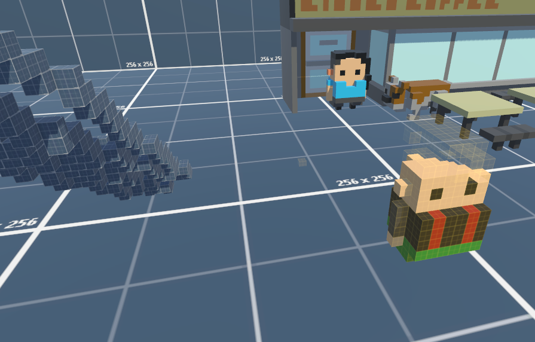

# Unity Voxel
Adds "native" support to MagicaVoxel ".vox" files by creating models / textures for use on import.

Has methods to partially build meshes, useful for dynamic build systems and destroying parts of models.

# How to Use

Copy All Files To Directory
Copy Resources/Materials

Install Mathematics, Burst, Unity.Collections from package manager
Build System Controls Uses old input system, change settings to Both or replace.

### Forked from MagicaVoxel-Unity-Importer

[https://github.com/korobetski/MagicaVoxel-Unity-Importer](https://github.com/korobetski/MagicaVoxel-Unity-Importer)

Changes
 - Converted to Unity mathematics for Burst Support
 - Added Job to build Mesh
 - Added Base VoxelObject Class
 - Added VoxelAsset to read voxels from data
 - Meshbuilding can partially build object
 - Added Basic Voxel Building System